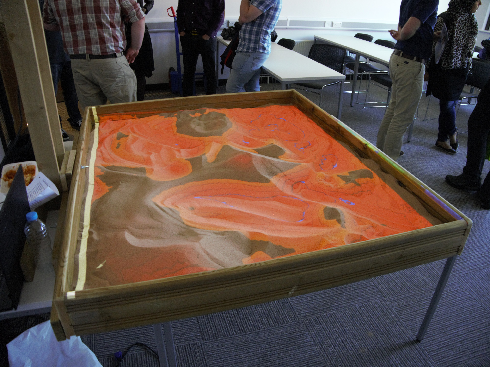

## MARSBox - Matt's Augmented Reality Sandbox

This project is the result of my third year university project, and is still being developed.  The code will be uploaded once I think it has been improved sufficiently.

Basic program details

* Language  - C++
* Libraries - GLFW, Kinect 2
 
Basic program steps

1. Acquire depth data from Kinect V2
2. Convert all depth data to a HSV colour via interpolation
3. Apply marching squares to the depth data to acquire contour lines
4. Draw all colours and contours to the screen
5. Repeat until program is stopped

On a Lenovo G50-70 laptop, I get about 8FPS, but on a PC can get the full 30FPS which is only limited by the Kinect's capture rate.  If some settings are changed, the laptop is able to get even better framerates with minimal loss in quality.

Here is a demonstation video from this year's project fair.

https://youtu.be/_3MYQaCjBjU?t=56s

Here are some pictures showing what I have so far.

